Documentation of 2. Project Implementation for IPP 2023/2024 \
Name and surname: Kirill Shchetiniuk \
Login: xshche05
# IPPcode24 interpreter documentation (interpret.php)
## Table of Contents
- [IPPcode24 interpreter documentation](#IPPcode24-interpreter-documentation)
    - [Introducing](#introducing)
    - [Architecture Overview](#architecture-overview)
        - [Used design patterns](#used-design-patterns)
        - [Internal memory and variables representation](#internal-memory-and-variables-representation)
            - [Memory value](#memory-value)
            - [Variable](#variable)
            - [Memory frame](#memory-frame)
    - [Steps of interpretation](#steps-of-interpretation)
        - [Input code validation](#input-code-validation)
        - [Program construction](#program-construction)
        - [Execution](#execution)
    - [Extensions](#extensions)
        - [FLOAT](#float)
        - [STACK](#stack)
        - [STATI](#stati)
    - [UML class diagram](#uml-class-diagram)

## Introducing
As an assignment we have to implement simple **IPPcode24** interpreter. Interpreter gets as input already parsed **IPPcod24** in XML format a input data for interpreted program. Interpreter executes instructions one by one in specified order given by instruction tag `order` attribute in input XML. In case of any runtime errors interpreter exits with specified exit code, otherwise finishes program's execution and exits with code `0`. In case of executing `EXIT` instruction, interpreter finishes program's execution and exits with code (`0-9`) specified as instruction argument.
## Architecture Overview
The whole project is implemented using `PHP 8.3`. As a project base is used provided `ipp-core`, which gives us several predefined instruments, such as streams' communication interfaces and classes, abstract class `IPPException` for implementing custom exceptions and others. For implementing more complex things specified in the assignment standard `Settings` class was extended by `\IPP\Student\Settings` and stream readers/writes were extended by using custom ones. For easy code management were also used some different traits.
### Used design patterns
Interpreter implementation use following design pattern such as builder, singleton, abstract factory and delegation structural pattern. Builder design pattern is used to perform `Program` construction, `Instruction` construction. Abstract factory is implemented in `ArgumentFactory` to perform construction of corresponding class instance according to provided argument type in source code. Singleton is presented as `Executor`  and used to restrict multiple `Executor` instances. Delegation structural pattern is used to delegate execution requests got by instructions to  `Executor` using the corresponding method
### Internal memory and variables representation
For easy `IPPcode24` memory management are implemented some additional classes such as `MemoryValue`, `Variable` and `MemoryFrame`.
#### Memory value
`MemoryValue` class is representing every single value inside interpreted program, this value representation have information about value type and value itself. This also mainly used to save data on the data stack and perform basic arithmetic operations.  `MemoryValue` always have specified type and value.
#### Variable
`Variable` class is representing every single variable inside interpreted program,  this class extends `MemoryValue` class. This representation is supposed to store information about variable such as type, value and current variable state such as initialized or uninitialized, which give as information if we can perform any "read value" operations with variable. After defining variable using `DEFVAR` variable is uninitialized, after first value writing to specified variable it becomes initialized and cant be uninitialized later. Variable initializing can be performed by using `MOVE` or `POPS` instruction.
#### Memory frame
`MemoryFrame` class is representing singular frames which stores different variables. Every frame has its own namespace for variables, it means what two different frames can have variables with the same name. Variables are being added to frame during variable definition using `DEFVAR`. In the same time can be accesses max  3 frames, such as `GF`, `TF` and `LF`. `GF` frame is always  accessible in any time, `TF` and `LF` are accessible if they were already defined by corresponding instructions.
## Steps of interpretation
### Input code validation
First of all, input program in XML format goes through several layers syntax of validation. Firstly every input XML is validated by provided `ipp-core`, in case of any errors in basic XML structure interpreter exits with code `31`. The next step is validation according to specified XML format for `IPPcode24`, like input contains only allowed tags and attributes, this step of validation is implemented by using the XSD scheme, which is specified inside of `schema.xsd` file. Some other cases are being validated in runtime.
### Program construction
When basic input program requirements was successfully validated input code is parsed. Input program is fully loaded and transformed to internal program representation by using the `ProgramBuilder` which gives as a result a `Program` object. During program building each instruction is transformed to corresponding `Instruction` object by simply using the `InstructionBuilder` and added to internal program instruction flow as a pair of instruction order and instruction object. In case of `LABEL` instruction, corresponding label is added to label map to be able to perform any jumps and calls.
### Execution
After successful program construction execution is being started. Execution performs inside the `Executor` class, which contains basic executor logic and corresponding methods for each supported instruction. Basic executor logic is implemented inside the `ExecutorBaseLogicT` trait, instructions are implemented in following traits:
- `BasicExecutorT` - basic instructions provided by the assignment
- `FloatExecutorT` - instructions to support float operations
- `StackExecutorT` - instructions to support stack operations
- `FloatStackExecutorT` - instructions to support float stack operations

Execution is performed by simply using cycle which increments instruction pointer and tries to get instruction with corresponding order. Execution ends by simply getting to the program ending, by using `EXIT` instruction or in case of any runtime error. All program inputs requested by `READ` instruction is obtained from `--input` file or `stdin`, all default outputs, `WRITE` instruction, is printed to `stdout` and all debug info, `DPRINT` and `BREAK` instructions, is printed to `stderr`
## Extensions
### FLOAT
`FLOAT` extension provide some new instructions such as float division, integer to float, float to integer conversion and add functionality for some basic instructions such as arithmetic instructions, read and write instructions. `READ` instruction support reading all default float formats for PHP and `WRITE` instruction prints float using scientific notation using following format `%.10e`.
### STACK
`STACK` extension provide new instructions, mostly arithmetic, to perform calculations and other operations on data stack. Stack operations get parameters from stack, stack top is second parameter, result of arithmetic stack operation is pushed back on stack.
### STATI
`STATI` extension provide instruments to collect execution statistics and write required statistics to output file. Default `Settings` class was extended to perform `STATI` extension's command line arguments parsing and some additional methods were implemented to collect all specified statistics.
## UML class diagram

